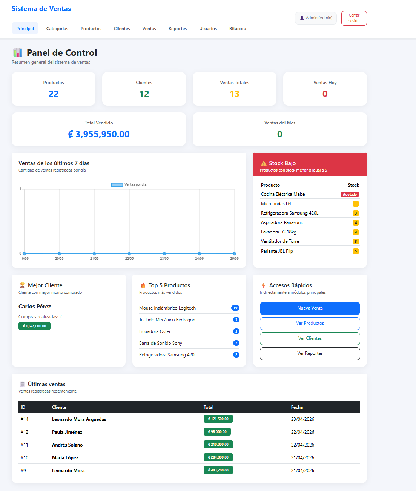
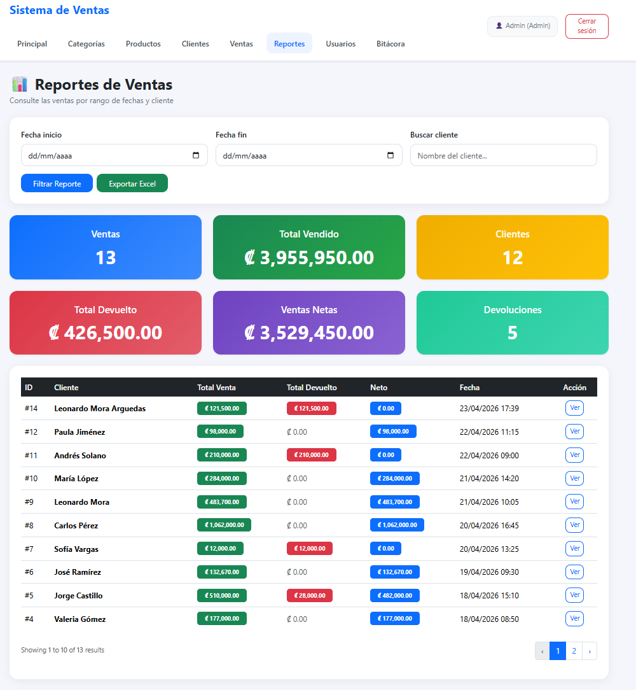
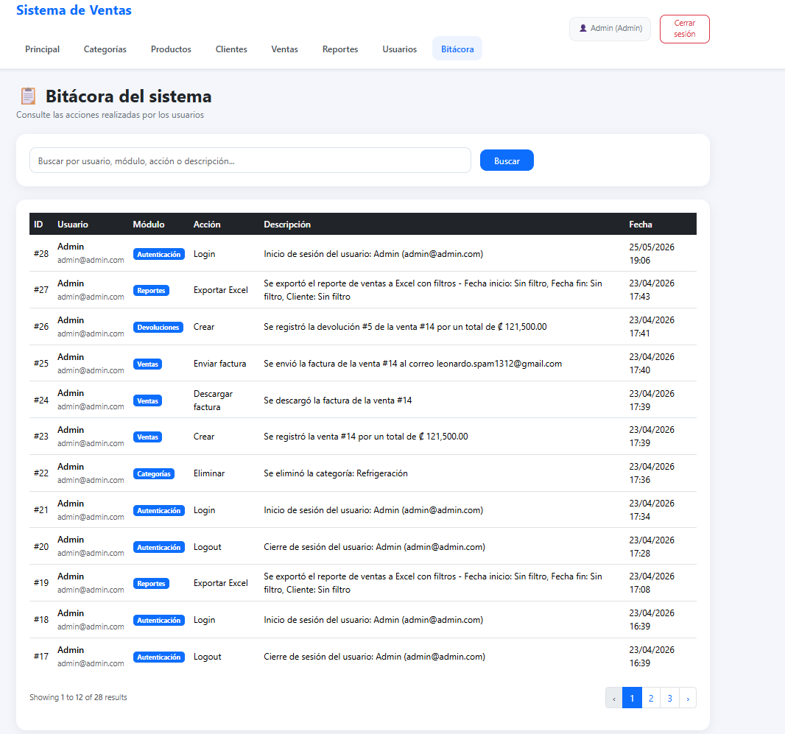

# Store Admin Dashboard

Proyecto universitario de administración de tienda desarrollado con Laravel, Docker y Vite.

## Tecnologías utilizadas

- Laravel
- PHP
- Docker
- Docker Compose
- MySQL
- Vite

## Funcionalidades

- Gestión de productos
- Gestión de inventario
- Panel administrativo
- Login de usuarios
- Reportes básicos
## Capturas

### Dashboard


### Reportes


### Bitacora


## Documentación

- [Manual de Usuario](docs/manual-usuario.pdf)
## Instalación

```bash
docker-compose up --build
```

## Autor

Leo Mora